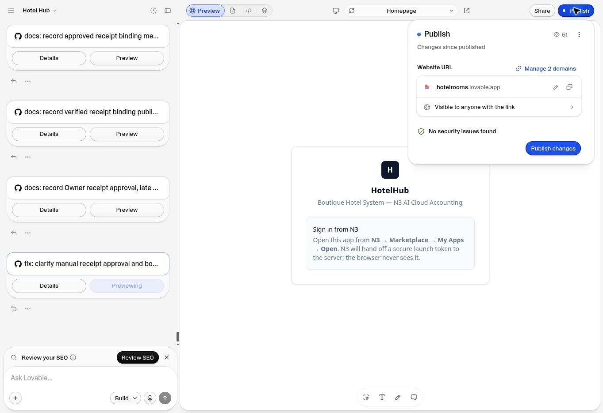

# Checkout followthrough — approved code merge, publication pending

Date: 2026-10-03 UTC. Upload to Project Sources: No.
Status: CODE MERGED / LOVABLE SYNC VERIFIED; NOT PUBLISHED by this continuation.

## Authorization and exact source

Owner replied “uploaded. Approve” to the explicit code-merge gate for
`734ac405c82e653a7098ce0ef22d51586382bd9d`. The uploaded change impact map is
byte-identical to `docs/HH_CHANGE_IMPACT_MAP.md`. This approval covers the code
merge only. It does not approve public publishing, database changes, separate
function deployment, N3 transactions or external alerts.

| Item | Verified result |
| --- | --- |
| Repository / default branch | mugs-AI/hotel-hub / main |
| Previous main | af6c47732dd79a2f944b34576b48abc53783e703 |
| Approved and merged source | 734ac405c82e653a7098ce0ef22d51586382bd9d |
| Exact candidate/main tree | 77e39c50af8b9a17b93c36e1ec64c2fca08d4de4 |
| Review branch | review/hh-receipt-diagnostic-20261002 |
| Lovable project | d6c78e7b-c2f2-4bee-bf99-c9c47ff29b76 |
| Lovable workspace | JRQygHE7tZl2GgPN8a8N |
| Lovable synced branch | main, connected to mugs-AI/hotel-hub |
| Lovable latest commit | 734ac405c82e653a7098ce0ef22d51586382bd9d, ready, agentFinished=true |

Fresh Git remote refs and connector reads agreed on previous main and exact
candidate before execution. Previous main was an ancestor of the candidate.
GitHub update_ref moved main with force=false; a fresh connector read and local
fetch confirmed the exact approved SHA/tree. No history was rewritten.

Lovable Settings → Git → GitHub explicitly showed main and “In sync with GitHub”.
After the merge, Re-check sync status showed “Lovable and GitHub are on the same
commit”, synced less than a minute earlier. The project API independently returned
the exact merged SHA and ready status. No Lovable AI Build message was sent.

## Verification and limits

The clean candidate was independently rerun before merge with live/database/N3
write variables removed: Vitest 121 files passed / 3 skipped; 1937 tests passed /
20 skipped / zero failures, exit 0, duration 9.24 s. This confirms the exact
reviewed source tree. Type/style/build and independent-review evidence remain in
`../HH_CHECKOUT_FOLLOWTHROUGH_CANDIDATE.md` and
`HH_CHECKOUT_FOLLOWTHROUGH_GATES_20261003.txt`; no product source changed afterward.

Protected baseline comparison to a68664f56e38bfb74e32972c14becdc6e6938449 exited 0
before and after merge for AGENTS.md, package.json, bun.lock, src/start.ts,
src/integrations and src/lib/hotel-store.server.ts. Whole merge whitespace check
also exited 0. Worktree/index were clean before this documentation-only evidence
commit. These new notes and screenshot stay on the review branch, so main remains
the exact approved candidate.

The merge changes the four product files and one regression-test file identified
in the candidate, plus documentation/evidence. No API/server, SQL/RPC, schema,
migration, generated auth/integration, secret, N3 transport or financial-proof
change is added by this merge. The existing Lovable Cloud backend and hosting
remain in place. Earlier applied migrations are not reapplied.

Credential-gated live SQL tests remain skipped. Signed-in operational persistence,
native mobile-picker appearance and completed manual N3 correction/Verify remain
pending; this code merge does not establish those acceptance results.

## Separate publishing lane

Read-only editor inspection showed “Publish, unpublished changes available”,
“Changes since published”, the existing hotelrooms.lovable.app URL and a
“Publish changes” button. The final button was not clicked. Saved UI proof:

Latest previously verified public source remains af6c47732dd79a2f944b34576b48abc53783e703,
deployment 65124126-ce79-41bb-855b-27f9ef12a969, from the preceding publication
record. Public HTTP serving identity was not freshly rechecked in this code-merge
lane. There is no new deployment ID or public acceptance claim here.

Next gate: approve publishing only exact source
734ac405c82e653a7098ce0ef22d51586382bd9d to the existing HotelHub host. Before
publishing, recheck main/Lovable SHA and activity; stop if the source has changed.
After publication, record the actual deployment and public HTTP identity before
claiming release. Database, function, N3-write and external-alert lanes remain
separate and unexecuted.

Receipt OR2610/001 should still display verified MYR50 until the Owner completes
the approved manual change in N3 and Verify proves the exact MYR60 receipt/journal.
Approval alone does not update N3 or financial figures; this merge clarifies that
workflow and improves Late Checkout input/refusal guidance and dependent refreshes.
