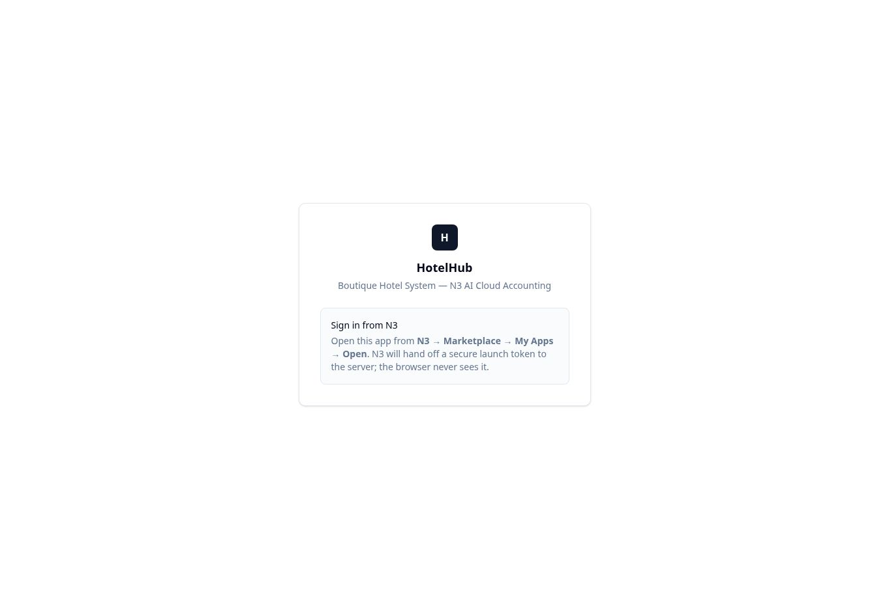

# Checkout followthrough — approved publication

Date: 03/10/2026, Asia/Kuala_Lumpur. Upload to Project Sources: No.
Status: PUBLISHED; deployment identity and signed-out live smoke VERIFIED.
Signed-in operational acceptance and manual N3 correction/Verify remain PENDING.

## Authority and exact release

Owner replied APPROVE to the explicit publication gate for exact source
734ac405c82e653a7098ce0ef22d51586382bd9d on the existing hotelrooms.lovable.app
host. This is the bounded Late Checkout input/refusal, receipt guidance and
dependent refresh correction, not full HotelHub go-live acceptance or permission
for financial transactions, database changes or unrelated releases.

Product: HH1.0 HotelHub. Repository: mugs-AI/hotel-hub, synced branch main.
Lovable project: d6c78e7b-c2f2-4bee-bf99-c9c47ff29b76.
Workspace: JRQygHE7tZl2GgPN8a8N.
Published source: 734ac405c82e653a7098ce0ef22d51586382bd9d.
Published tree: 77e39c50af8b9a17b93c36e1ec64c2fca08d4de4.
Review evidence parent: 2cd3c9b694019785978f1d32bca6c47d863dc458.

Fresh remote main and Lovable API reads agreed before publication. Lovable was
ready and agentFinished=true. The worktree/index were clean. Protected paths
AGENTS.md, package.json, bun.lock, src/start.ts, src/integrations and
src/lib/hotel-store.server.ts matched a68664f56e38bfb74e32972c14becdc6e6938449.
Review and main had no src/supabase/package/lock/AGENTS differences. The preceding
merge record establishes actual synced main and editor preview. Post-publication
remote main and Lovable latest still matched the exact approved source.

## One publication, independent serving proof

One lovable_deploy_project call targeted the locked project, preserving the
existing host. It returned pending, observed at 2026-10-03T06:49:05.316Z
(14:49:05 Malaysia), with deployment ID:

`3480110d-0dd7-4ad1-8ad7-b3843ab39be5`

No duplicate publish call was made. The editor progressed from Updating to
“Your website was updated”. Before publication, a public GET still served the
previous deployment 65124126-ce79-41bb-855b-27f9ef12a969. After publication, a
cache-bypassed public GET returned:

```text
HTTP/2 200
content-type: text/html; charset=utf-8
cache-control: no-cache, must-revalidate, max-age=0
x-deployment-id: psr2.3480110d-0dd7-4ad1-8ad7-b3843ab39be5.1791614985.j4ooW8vrUvw4dtC3XV1UtYLT8FzHkSdg0o5lxH6oupk
HTML SHA256: 83d4f905c74fc15b0524b5dbd450e02bd9b6ad9d9987ddc6da7af62928e0a4e5
```

HTTP inspection used curl --max-time 25 with Cache-Control: no-cache, saving
temporary headers/body and retaining only deployment/content/cache/status and
body hash. The public header independently proves deployment identity. Exact
Git source attribution uses the unchanged locked SHA before and after publishing;
the public deployment header does not itself contain a Git SHA.

Fresh browser navigation to https://hotelrooms.lovable.app/ loaded the established
HotelHub Sign in from N3 page after Loading session, with Marketplace/My Apps
instructions. No developer sign-in or financial figures appeared. No N3 sign-in,
Late Checkout submission, approval or receipt verification was performed.



## Read-only backend checkpoint

Lovable database status for the locked project returned enabled=true,
stack=supabase. Existing Lovable Cloud PostgreSQL remains the backend; configured
reference fkakhdzelilnejyehwfk and the established TanStack Start/Nitro/Cloudflare
runtime remain unchanged. No new backend, credentials or standalone Edge Function
deployment was introduced. Publication deploys the existing application runtime.

A single SELECT-only read at 2026-10-03T06:51:14.127127Z was constrained to the
saved reservation/deposit and joined the request on tenant/reservation/deposit.
Execution/version counts were similarly scoped. Actual results:

| Readback | Result |
| --- | --- |
| Receipt | OR2610/001 |
| Original deposit | MYR50.00, posted |
| Deposit updated_at | 2026-10-01T13:29:10.589519+00:00, unchanged |
| Manual correction request | approved_awaiting_n3, version 2 |
| Original / proposed | 5000 / 6000 cents |
| Executions / verified versions | 0 / 0 |
| Already-applied receipt migrations | 20261002053219 and 20261002053302 present |

This is HotelHub database readback, not a fresh N3 journal read or full new
schema/RLS/grant audit. No migration was reapplied. The previously recorded
generated-type receipt-table parity gap remains documented, with unchanged
bounded server adapters. No SQL/data write, secret change, N3 write, correction,
void, replacement, refund, alert delivery or operational apply occurred.

## Engineering evidence and next acceptance

The exact published tree retains the fresh merge-gate result: 1937 tests passed,
20 skipped, zero failures. Prior type/style/production build and independent
review evidence is in ../HH_CHECKOUT_FOLLOWTHROUGH_CANDIDATE.md and
HH_CHECKOUT_FOLLOWTHROUGH_GATES_20261003.txt. No product code or dependencies
changed in this publication turn, so those checks were not duplicated or
represented as new live signed-in tests.

Code merge/sync: COMPLETE. Public/runtime publication: COMPLETE.
Database changes and standalone function deployment: NONE.
N3 financial writes and external alerts: NONE.
Signed-in native-picker/persistence and manual correction/Verify: PENDING.

Owner next reopens HotelHub through N3 and opens BK260920001 Prepare Checkout.
Read-only acceptance: check Late Checkout shows the saved departure date, a
time-only input and compact time/reason row; check the approved receipt clearly
says to complete in N3 then Verify. Do not create a duplicate correction request.
Another-day departure must use Extend Stay under existing approval rules.

The amount should remain verified RM50 until the Owner completes the already
approved manual change in N3 and HotelHub Verify proves the exact RM60 receipt
and journal. This release does not make requested RM60 effective prematurely.
Receipt P1 is not closed until that completion/readback succeeds. Signed-in UAT
results must be recorded as observed, not inferred from isolated tests.

Automatic N3 edit/void/replacement remains off, cancelled flags alone remain
insufficient proof, Sales/Collections remain Unavailable, monthly figures retain
N3 receipt dates and >100-candidate Unavailable behavior, tenant/role/auth controls
remain authoritative, and external delivery remains disabled pending configuration.

This release record and screenshot are saved on review/hh-receipt-diagnostic-20261002;
main stays at the exact published source. Historical merge/candidate pending states
are superseded by this record. No Project Sources upload is required.
